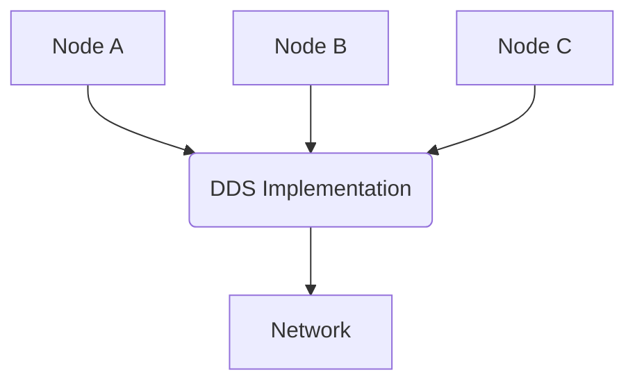
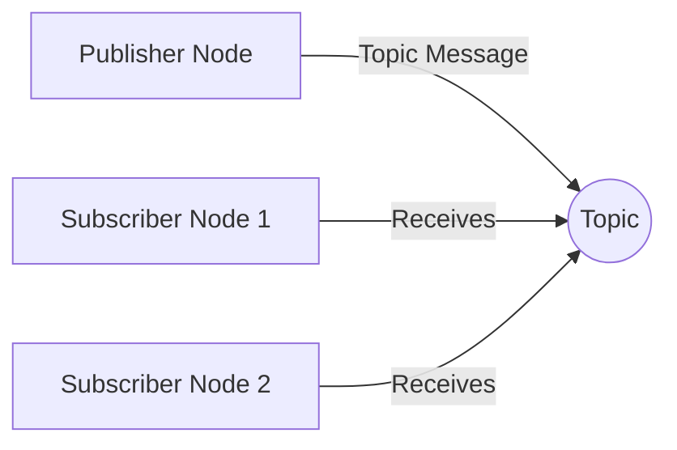
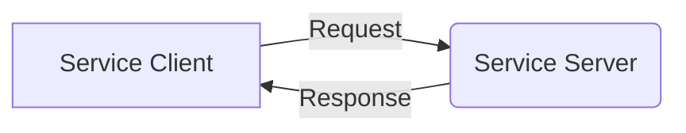
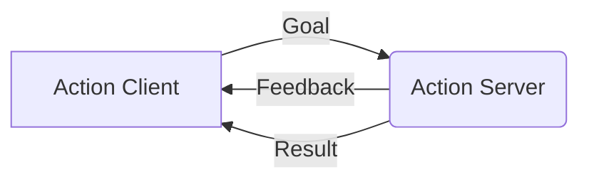

# Basic ROS 2 Architecture

This diagram illustrates the fundamental architecture of ROS 2 (Robot Operating System 2), showing how different components interact to form a complete robotic system.

## Core Architecture Components

### 1. DDS (Data Distribution Service) Layer
The Data Distribution Service (DDS) layer serves as the communication backbone of ROS 2. It provides a standardized middleware that enables different nodes to communicate seamlessly, regardless of their location in the network.

- **Discovery**: Nodes automatically discover each other on the network
- **Transport**: Handles message delivery between nodes using various protocols (TCP, UDP, shared memory)
- **Quality of Service**: Configurable policies for reliability, durability, and performance

### 2. Client Libraries
ROS 2 provides client libraries that abstract the complexity of DDS communication:

- **rclcpp**: C++ client library
- **rclpy**: Python client library
- **rcl**: Core client library in C
- **rclc**: C client library for microcontrollers

### 3. Nodes and Communication Primitives
The core communication mechanisms in ROS 2:

#### Nodes
Independent processes that perform specific functions:



#### Topics (Publish/Subscribe)
Asynchronous communication pattern for streaming data:



#### Services (Request/Response)
Synchronous communication for specific requests:



#### Actions (Goal/Feedback/Result)
Long-running tasks with feedback:



## Physical AI & Humanoid Robotics Context

In the context of Physical AI and Humanoid Robotics, the ROS 2 architecture enables:

### Distributed Intelligence
- Sensor processing nodes can run on edge devices
- AI inference nodes can run on GPU-enabled systems
- Control nodes can run on real-time systems
- All coordinated through ROS 2 middleware

### Multi-Modal Perception
- Vision sensors publishing to image topics
- Audio sensors publishing to audio topics
- Tactile sensors publishing to haptic topics
- All integrated through a central perception node

### Control Architecture
```
[High-level AI Planner] 
    ↓ (action goals)
[Behavior Controller] 
    ↓ (joint commands)
[Hardware Interface] 
    ↓ (low-level control)
[Robot Hardware]
```

## Quality of Service (QoS) Considerations

For humanoid robotics applications, different QoS profiles are essential:

| Component | Reliability | Durability | History | Use Case |
|-----------|-------------|------------|---------|----------|
| Joint States | Reliable | Volatile | Keep Last | Critical for control |
| Camera Images | Best Effort | Volatile | Keep All | Real-time perception |
| Map Data | Reliable | Transient Local | Keep All | Persistent data |
| Diagnostics | Best Effort | Volatile | Keep Last | Monitoring |

## Security Architecture

ROS 2 includes security features critical for robotic systems:

- **Authentication**: Verifying node identity
- **Authorization**: Controlling access to topics/services
- **Encryption**: Protecting data in transit
- **Signing**: Ensuring message integrity

## Deployment Architecture for Humanoid Robots

### Centralized Architecture
```
[Master Node]
    ├── [Perception Nodes]
    ├── [Planning Nodes]
    ├── [Control Nodes]
    └── [Interface Nodes]
```

### Distributed Architecture
```
[On-Robot Processing]
    ├── [Low-level Control] 
    └── [Real-time Perception]
[Off-Robot Processing]
    ├── [High-level Planning]
    └── [AI Reasoning]
```

## Integration with Other Systems

### NVIDIA Isaac Integration
- Isaac ROS packages for accelerated perception
- Hardware abstraction for NVIDIA platforms
- GPU-accelerated computer vision

### Gazebo Simulation
- Physics simulation of humanoid robots
- Sensor simulation for development
- Integration with ROS 2 communication

## Best Practices for Architecture Design

1. **Modularity**: Design nodes with single responsibilities
2. **Scalability**: Consider performance implications of communication patterns
3. **Real-time Requirements**: Use appropriate QoS settings for time-critical data
4. **Security**: Implement security policies for sensitive applications
5. **Monitoring**: Include diagnostic nodes for system health
6. **Fault Tolerance**: Design for graceful degradation when components fail

## Acceptance Scenarios

The basic ROS 2 architecture is properly understood when:

**Scenario 1**: As a robotics architect, when I design a humanoid robot system, then I should be able to structure nodes and communication patterns according to ROS 2 architectural principles.

**Scenario 2**: As a developer, when I implement a distributed robotic system, then nodes should communicate reliably using appropriate QoS settings for different data types.

**Scenario 3**: As an integrator, when I combine perception, planning, and control systems, then they should integrate seamlessly through the ROS 2 middleware.

## Next Steps

Once you understand the basic ROS 2 architecture, explore advanced architectural patterns in Module 2, including digital twin integration with Gazebo and Unity, and the AI-robot brain architecture using NVIDIA Isaac.